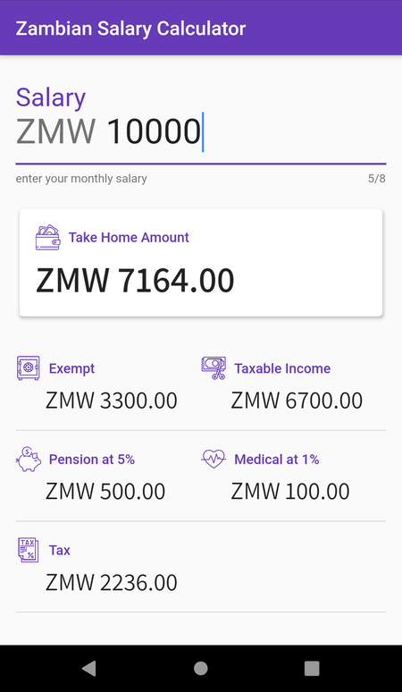

# Zambian Income Tax Calculator

### Running It
    flutter packages get
    flutter run

### Screenshot

### Thanks for contributing
  - [Alick Chinga](https://github.com/Chingaipe) - [Reworked UI](https://github.com/twmbx/flutter-tax-calc/pull/2)

#### Icon Attribution
Icons made by [Freepik](https://www.flaticon.com/authors/freepik) & [photo3idea_studio](https://www.flaticon.com/authors/photo3idea-studio) from [www.flaticon.com](https://www.flaticon.com/)

## License

The MIT License (MIT). Please see [License File](LICENSE.md) for more information.

Made with :heart: in :zambia:
